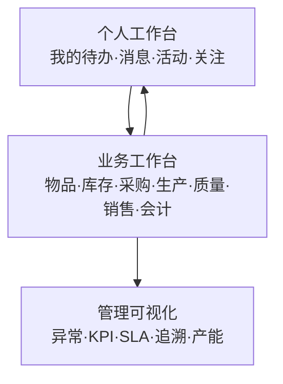

# Carbon MOM 个人工作台设计规范

## 1. 产品定位

“个人工作台 + Carbon 原有业务体系 = Carbon MOM”。个人工作台是面向人的 MOM 入口，负责回答“我现在要处理什么、刚刚做了什么、哪些事情有风险”；ERP/MES 模块继续负责业务对象、状态和执行。工作台不替代业务模块，而是把跨模块责任、事实和行动串起来。

## 2. 三层产品结构

- 个人层：按登录用户和当前公司展示责任与历史。
- 业务层：各模块提供权威记录、编辑、审批和执行动作。
- 管理层：在已有事实之上汇总过程健康度和例外，不在首期复制 BI 系统。

## 3. Items 首期信息架构

在 Items 侧栏底部新增与“管理、材料属性、配置”并列的“个人工作台”组。首期页面建议四个视图：

1. **概览**：待办、未读消息、近期开工/编辑/配置活动、失败导入和需要关注的物品。
2. **我的活动**：导入、编辑、配置三类历史，可按今天、近 1/2/3 天、近 1/2 周和自定义日期筛选。
3. **我的任务与消息**：任务、审批、通知、系统消息分栏，显示状态、优先级、截止时间、来源对象和下一步。
4. **关注与快捷入口**：用户主动关注的物品/工艺路线/导入批次，以及继续导入、打开差异、进入配置等动作。

活动卡片必须显示：时间、动作、模块、实体名称/编码、结果、操作者、来源链接和可用动作。实体已删除时保留事件摘要并标记“对象已删除”。

## 4. 统一数据契约

### 4.1 活动投影 `workbenchActivity`

建议新增公司级表（名称以最终迁移评审为准）：

| 字段 | 说明 |
|---|---|
| `id` | `id('wba')`，稳定活动 ID |
| `companyId` | 租户边界，复合索引第一列 |
| `actorId` | 执行人；系统活动允许为空 |
| `module` | `items/inventory/purchasing/production/quality/sales/accounting` |
| `action` | `import/create/update/configure/approve/complete/fail` 等枚举 |
| `entityType`, `entityId` | 可追溯业务对象 |
| `entityLabel` | 当时的展示快照，避免对象删除后不可读 |
| `sourceId`, `sourceType` | 导入批次、工单、任务等来源 |
| `result` | `success/failed/partial` |
| `metadata` | 经过 schema 校验的摘要，不放密钥和敏感正文 |
| `occurredAt` | 带时区业务时间 |
| `idempotencyKey` | 来源事件或批次的幂等键，唯一约束 |
| `createdAt` | 投影写入时间 |

审计日志仍是合规源；`workbenchActivity` 是面向查询的读取投影，不允许用户直接编辑。已有历史可按明确的 backfill 窗口导入，并标记 `metadata.backfilled=true`。

### 4.2 任务 `workbenchTask`

任务必须有 `assigneeId` 或责任组、`status`、`priority`、`dueAt`、`completedAt`、`sourceType/sourceId`、`companyId` 和幂等键。状态建议 `open/in_progress/completed/cancelled/expired`，完成和完成时间同一事务写入。

### 4.3 通知 `workbenchNotification`

通知保存接收人、类型、标题、摘要、来源对象、严重级别、已读时间和归档时间。通知是信息，不等价于任务；确认通知不能自动完成业务任务。

## 5. 事件、审计和一致性

业务服务在同一事务内完成权威写入和必要的审计字段；提交后由事件系统生成活动/任务/通知投影。投影消费者必须：

- 使用来源事件 ID 或业务幂等键去重；
- 失败可重试并记录错误，不阻塞原业务写入；
- 支持按公司、模块、时间游标重放；
- 不将未授权实体投影给用户，查询时再次执行权限过滤；
- 提供投影延迟、失败数、重试次数和死信指标。

活动列表使用 cursor 分页，时间筛选按用户时区解释、数据库统一存带时区时间。默认保留 12 个月的个人活动，合规审计按现行审计保留策略执行；具体期限在数据治理评审中确认。

## 6. 权限与安全

- 工作台读取权限至少包含当前公司成员资格和对应模块的 view 权限；任务操作还要检查来源业务动作权限。
- 以服务端当前 session 的用户和公司为准，禁止使用 URL 中的 `companyId` 作为唯一授权依据。
- 跨公司切换后清理/刷新工作台查询缓存；公司选择、权限缓存和员工派生行必须保持一致。
- 活动摘要脱敏；附件只返回受权限保护的 Storage 深链。

## 7. Items 事件目录

| 场景 | 活动示例 | 快捷动作 |
|---|---|---|
| Excel 导入 | 导入批次成功、部分成功、失败、重复行 | 查看结果、下载失败行、继续导入 |
| 物品编辑 | 零件/材料字段、工艺路线、工时、材料/BOM 变更 | 打开物品、查看差异 |
| 配置 | 新增/修改物品组、尺寸、等级、形状、表面处理等 | 打开配置、撤销需单独权限 |
| 任务消息 | 分配、催办、审批、失败告警 | 接受、完成、转交、标记已读 |

## 8. 验收指标

- 用户能在 2 次点击内回到活动对应的业务对象。
- 近期开关筛选结果与用户时区一致，分页不重复、不漏项。
- 失败导入能定位批次和失败行；部分成功明确显示成功/失败数量。
- 无权限用户看不到活动摘要和来源对象；切换公司后不残留上一公司数据。
- 事件重复投递不会产生重复活动/通知；投影延迟和失败可在运维面板观察。

