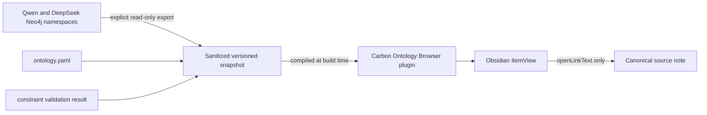

# Obsidian Read-Only Ontology Browser Design Specification

## Summary

Build an independent Obsidian desktop plugin named `Carbon Ontology Browser`. It presents the completed Qwen and DeepSeek MegaMem graphs as a search-first, read-only object explorer. The plugin consumes a sanitized graph snapshot compiled into its bundle and has no runtime network, database, MCP, graph-write, or Vault-write capability.

The existing MegaMem plugin remains disabled. The browser changes only its own plugin installation directory and Obsidian's community-plugin enablement list; it does not modify any Markdown note, frontmatter, link, attachment, or graph record.

## Research Summary

Research is recorded in `llm/research/obsidian-read-only-ontology-browser.md`.

- Palantir separates semantic objects/properties/links from state-changing actions and functions.
- Neo4j Bloom uses search, result lists, type context, and relationship expansion as its primary exploration flow.
- SAP separates named-graph query privileges and metadata from update privileges.
- Obsidian recommends a registered `ItemView` with lifecycle-local rendering and workspace-based activation.
- MegaMem's installed panel is not reused because the same compiled plugin registers sync and schema-discovery commands and provides no maintainable TypeScript source.

## Goals

- Make ontology objects, relationships, properties, source Episodes, and graph health visible inside Obsidian.
- Preserve a technically enforced no-write runtime boundary.
- Show DeepSeek results by default and retain Qwen as a comparison dataset.
- Let users move from an object to connected objects and then to the canonical source note.
- Surface the practical value of provenance, model comparison, temporal context, and deterministic constraints.
- Remain usable when Neo4j, Ollama, and the temporary MCP server are stopped.

## Non-Goals

- No note generation, frontmatter changes, backlink materialization, or native Obsidian Graph View mutation.
- No live Neo4j, FalkorDB, MCP, or online-model connection in v1.
- No graph, Episode, ontology, or constraint editing.
- No Carbon database, Supabase, U8, WodiMES, SQL, or API connection.
- No Actions, Functions, approval workflows, or operational object writeback.
- No force-directed graph canvas in the initial narrow panel.

## Architecture



### Source location

The maintainable source lives at:

`D:\Object\carbon\.codex\work\megamem-pilot\obsidian-ontology-browser`

The installed build lives at:

`E:\AI_Project_Vault\.obsidian\plugins\carbon-ontology-browser`

### Runtime boundary

The production plugin bundle:

- Imports one generated JSON snapshot at build time.
- Uses Obsidian `Plugin`, `ItemView`, `WorkspaceLeaf`, `setIcon`, and `openLinkText` APIs.
- Does not import Node filesystem, child process, HTTP, MCP, Neo4j, or model clients.
- Does not call `Vault.create`, `Vault.modify`, `Vault.delete`, `Vault.rename`, `adapter.write`, or equivalent methods.
- Does not store credentials, tokens, passwords, API keys, or source-note bodies.

## Snapshot Contract

The generated snapshot has this logical structure:

```ts
interface OntologySnapshot {
  schemaVersion: 1;
  generatedAt: string;
  database: "carbon-megamem-pilot";
  constraintSummary: {
    fixtures: number;
    passed: number;
  };
  datasets: OntologyDataset[];
}

interface OntologyDataset {
  id: "deepseek" | "qwen";
  label: string;
  namespace: string;
  model: string;
  stats: {
    objects: number;
    episodes: number;
    facts: number;
    mentions: number;
  };
  nodes: OntologyNode[];
  edges: OntologyEdge[];
  episodes: OntologyEpisode[];
  mentions: OntologyMention[];
}
```

### Node allowlist

Each node contains only:

- `id`, `name`, `types`, and `summary`.
- `status`, `owner`, `sourcePath`, `moduleType`, `version`, `ruleId`, `evidenceType`, and `locator` when present.
- `targetDate`, `decisionDate`, and `reviewDate` when present.
- `types` contains only the eight approved ontology labels. An empty array means
  the graph node remained generic; the UI derives `Unclassified` without adding
  a ninth ontology type or guessing a type.
- `sourcePath` is retained only when it matches an approved source note. A unique
  missing `.md` extension is normalized; other model-derived values are omitted.

The exporter rejects embeddings, arbitrary binary data, and unknown top-level output fields.

### Edge allowlist

Each fact edge contains:

- Stable UUID, source UUID, target UUID, relation name, and fact text.
- Episode UUID references and temporal validity fields.
- `classification: "defined" | "observed"`, computed from the 14 approved ontology relation names.

Embedding properties are never exported.

### Episode allowlist

Each Episode contains only UUID, source display name, canonical Vault path, source description, creation time, and validity time. Full note content is excluded.

### Mention allowlist

Each mention contains only its stable relationship UUID, Episode UUID, and node
UUID. Distinct mention relationships may share the same Episode/node endpoints;
the relationship UUID preserves raw graph counts while the UI deduplicates source
Episodes for display.

## User Interface

### View placement

- Register `carbon-ontology-browser-view` as an Obsidian `ItemView`.
- Open in the right sidebar by default and reuse an existing leaf when already open.
- Add a `network` ribbon icon and an `Open Carbon Ontology Browser` command.
- Use Obsidian CSS variables, typography, focus styles, and native Lucide icons through `setIcon`.

### Layout

The panel is a stable vertical layout with four bands:

1. **Toolbar**: dataset selector, snapshot status, reload-view icon.
2. **Metrics strip**: objects, facts, sources, and constraint fixtures.
3. **Search controls**: search input and entity-type menu.
4. **Content**: result list or selected-object detail.

The interface avoids nested cards. Result rows are separated list items; detail sections are unframed bands with compact headings.

### Search and filtering

- Search is case-insensitive over name, summary, type, status, source path, and locator.
- Results rank exact name matches first, then prefix matches, then token containment.
- The type menu includes `All`, derived `Unclassified`, and the eight approved
  Carbon entity types.
- Search never sends text outside the plugin process.
- Empty queries show recently ordered objects by type and name, not an empty screen.

### Object detail

Selecting an object shows:

- Name, ontology types, status, and compact allowlisted properties.
- Summary.
- Incoming and outgoing facts grouped by relation name.
- A visual distinction between `defined` and `observed` relation names.
- Connected object buttons that navigate inside the same view.
- Source Episodes with a read-only open-note icon when a canonical Vault path resolves.
- Back navigation that preserves the previous search and scroll position.

### Dataset comparison

- DeepSeek is the default dataset.
- The dataset selector switches to Qwen without merging identities across namespaces.
- Counts, results, details, and source links update atomically.
- The current model and snapshot timestamp remain visible so comparison is not mistaken for live data.

### States

- **Loading**: fixed-size skeleton rows while the bundled snapshot is validated.
- **Ready**: search results or selected detail.
- **No results**: concise empty state with the active filter visible.
- **Invalid snapshot**: error state with schema version and validation issue; no partial data renders.
- **Unresolved source**: source remains visible but the open-note control is disabled.

## Benefits Presented in the Panel

The UI exposes concrete results rather than a marketing explanation:

- Object and fact counts show what the graph added beyond folders and full-text search.
- Source Episode links demonstrate claim-level traceability.
- Defined/observed relation badges expose ontology conformance and extraction drift.
- Dataset switching demonstrates model quality differences with the same source baseline.
- Snapshot time and namespace make reproducibility and temporal context visible.
- Constraint-fixture status demonstrates that deterministic validation remains separate from AI extraction.
- Local bundled data demonstrates that browsing does not require an online model or active graph service.

## Security and Integrity Requirements

1. Keep `megamem-mcp` absent from `community-plugins.json`.
2. Add only `carbon-ontology-browser` to the enabled-plugin list after build verification.
3. Verify canonical source hashes 17/17 and scrubbed sample hashes 15/15 immediately before and after installation.
4. Scan source, bundle, snapshot, and plugin data for DeepSeek keys, Neo4j passwords, MCP tokens, and known credential patterns.
5. Assert that plugin source and bundle contain none of the prohibited write/network API tokens.
6. Do not start the temporary MCP server for panel operation.
7. Do not make Neo4j or Ollama availability a runtime dependency.
8. Do not persist search text or object history unless a later design explicitly approves it.

## Test Strategy

### Exporter tests

- Reject a graph row missing a stable UUID or namespace.
- Strip embeddings, full Episode content, and unknown properties.
- Map the 15 approved relative note paths to canonical Vault paths.
- Classify approved relation names as `defined` and all others as `observed`.
- Produce deterministic ordering and byte-stable JSON for identical input.
- Validate dataset counts against live read-only graph queries before build.

### TypeScript tests

- Reject unsupported snapshot schema versions and malformed references.
- Rank exact, prefix, and token search results in the required order.
- Filter by entity type without cross-namespace leakage.
- Resolve incoming/outgoing facts and Episode provenance.
- Preserve search state during object navigation and back navigation.
- Disable unresolved source-note actions.

### Static security tests

- Fail when source or bundle references network clients, Neo4j/MCP clients, child processes, or Obsidian Vault mutation APIs.
- Fail when the generated snapshot contains embedding keys, content fields, or secret values.
- Confirm manifest permissions and commands expose only panel opening.

### UI verification

- Render a browser preview with the production snapshot at narrow and wide panel widths.
- Capture light and dark mode screenshots.
- Verify no overlapping text, unstable metrics, clipped controls, or inaccessible icon buttons.
- Open the installed view in Obsidian, exercise search, filters, relation navigation, dataset switching, and source-note opening.
- Re-run source hashes after all UI interaction.

## Installation and Rollback

Installation copies only `manifest.json`, `main.js`, and `styles.css` to the new plugin directory and adds `carbon-ontology-browser` to Obsidian's enabled community-plugin list. It does not enable MegaMem.

Rollback disables and removes only `carbon-ontology-browser`. The Neo4j volume, MegaMem plugin directory, source notes, and pilot reports remain unchanged.

## Approval Gate

Implementation begins only after the user approves this design, including these choices:

- Independent plugin rather than modifying MegaMem's bundled code.
- Build-time sanitized snapshot rather than a live Neo4j or MCP connection.
- DeepSeek default with Qwen comparison.
- Read-only source-note opening and no Markdown generation.
